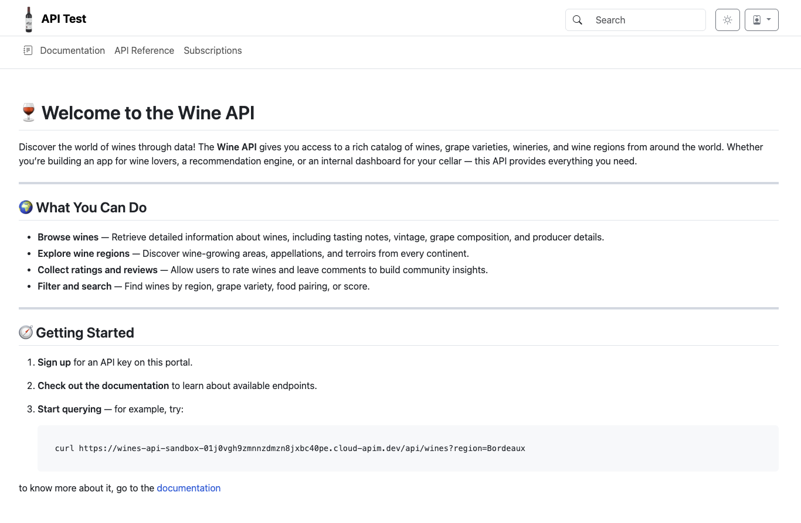
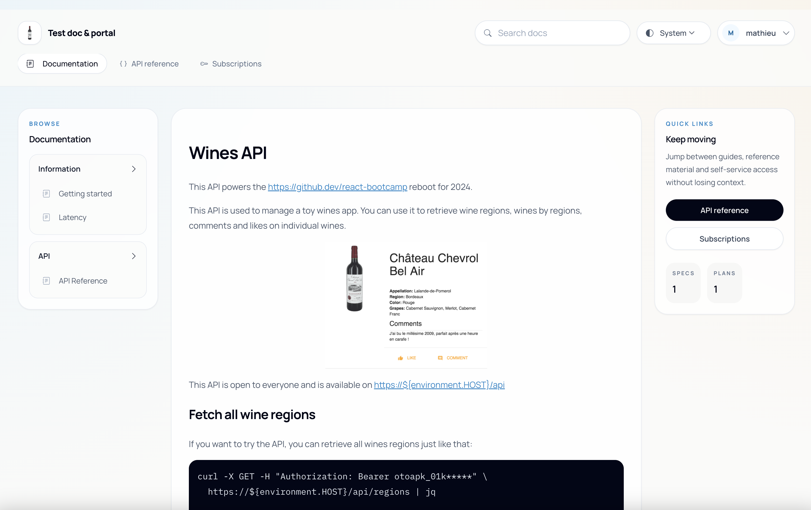
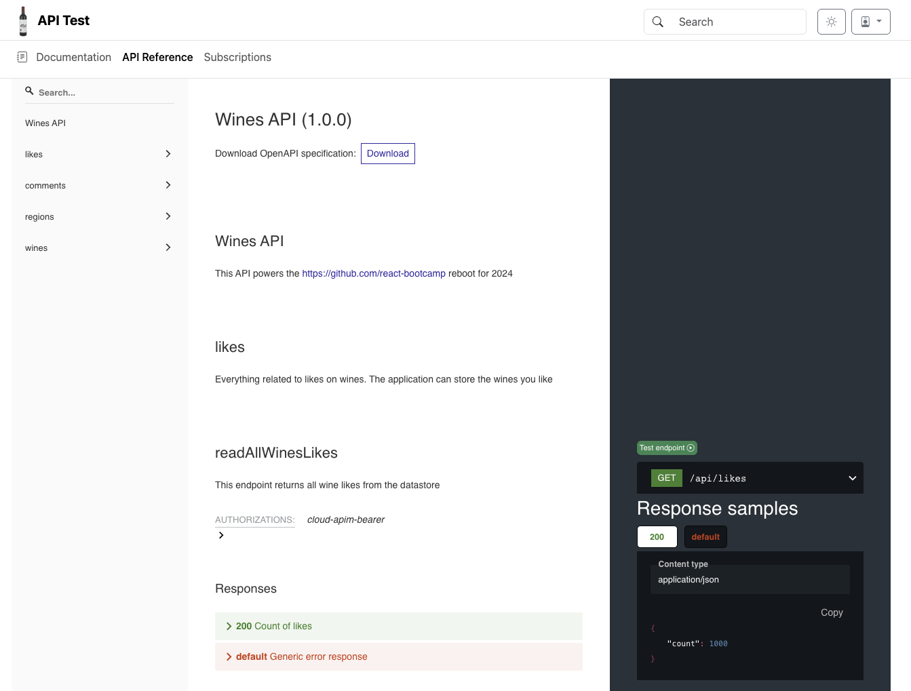

# Cloud APIM Otoroshi API Portal

a simple dev portal for Otoroshi APIs that supports documentation rendering, openapi rendering, api testing with user own apikey, subscription, search, etc

## Home

## Documentation rendering

## Openapi rendering

