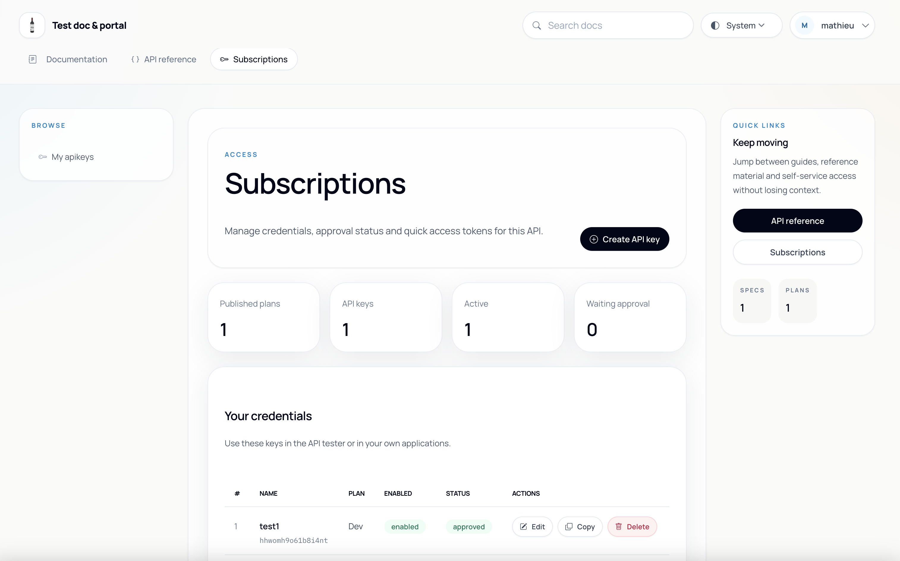

# Otoroshi API Portal

A lightweight, self-contained developer portal plugin for [Otoroshi](https://www.otoroshi.io/). It turns any Otoroshi API into a full-featured portal with documentation rendering, OpenAPI exploration, self-service API key subscription, and a built-in API tester -- all without deploying a separate frontend application.

## Why use it?

If you expose APIs through Otoroshi and need a developer-facing portal, you typically have two options: build a custom frontend or integrate a heavy third-party solution. This plugin offers a third path:

- **Zero infrastructure** -- the portal is served directly by Otoroshi as a backend plugin. No extra server, no Node.js app, no static hosting to manage.
- **Configuration-driven** -- everything (pages, navigation, OpenAPI specs, subscription plans) is declared in the API's `documentation` JSON section. Update the config, the portal updates instantly.
- **Self-service subscriptions** -- authenticated users can subscribe to published plans, get API keys, and start calling your API immediately. Plans support auto-validation or manual approval workflows.
- **Built-in API tester** -- users can test endpoints directly from the portal using their own API keys, without leaving the browser.
- **Dark mode, responsive, modern UI** -- the portal ships with a polished Tailwind CSS interface that works on desktop and mobile out of the box.

## Features

- Home page with HTML or Markdown content
- Documentation pages with sidebar navigation (categories and links)
- Markdown rendering (via [zero-md](https://github.com/nickabal/zero-md) web component)
- OpenAPI specification rendering (via [Scalar](https://github.com/scalar/scalar))
- Multiple OpenAPI spec support with a selection page
- Self-service API key subscription with plan selection
- API key management (create, update, delete, copy bearer token)
- Built-in API tester with request/response inspection
- Remote content loading (documentation pages and resources fetched from URLs)
- Remote portal configuration (load the entire `documentation` section from a URL)
- Redirections
- Light / Dark / System theme with persistence
- Authentication integration via Otoroshi auth modules
- Otoroshi cluster support (leader/worker mode)

## Screenshots

### Home


### Documentation


### OpenAPI reference


### Subscriptions



## Installation

1. Download the latest JAR from the [releases page](https://github.com/cloud-apim/otoroshi-api-portal/releases)
2. Add the JAR to your Otoroshi plugins directory (see [Otoroshi documentation](https://maif.github.io/otoroshi/manual/plugins/index.html) on loading external plugins)
3. Restart Otoroshi -- the plugin `Otoroshi API Portal` will appear in the available plugins list

## Setup

Using the portal requires two things: an **API** with a `documentation` section, and a **Route** that serves the portal.

### 1. Configure your API documentation

In the Otoroshi admin, create or edit an API (`apis.otoroshi.io/Api`). Add a `documentation` section to it. Here is a minimal example:

```json
{
  "documentation": {
    "enabled": true,
    "home": {
      "path": "/home",
      "content_type": "text/html",
      "site_page": true,
      "transform": "markdown",
      "text_content": "# Welcome\n\nThis is my API portal."
    },
    "logo": {
      "url": "https://example.com/logo.png",
      "path": "/favicon.png",
      "content_type": "image/png"
    },
    "references": [
      {
        "title": "My API",
        "link": "/openapi.json"
      }
    ],
    "resources": [
      {
        "title": "My API",
        "path": "/openapi.json",
        "content_type": "application/json",
        "url": "https://example.com/openapi.json"
      }
    ],
    "navigation": [
      {
        "label": "Documentation",
        "icon": { "css_icon_class": "bi bi-journal-text me-2" },
        "path": "/documentation",
        "items": [
          {
            "label": "API",
            "kind": "category",
            "links": [
              {
                "label": "API Reference",
                "link": "/api-references",
                "icon": { "css_icon_class": "bi bi-braces me-2" }
              }
            ]
          }
        ]
      }
    ],
    "plans": [
      {
        "id": "free",
        "name": "Free",
        "description": "A free plan to try the API",
        "access_mode_configuration_type": "apikey",
        "access_mode_configuration": {
          "throttling_quota": 10,
          "daily_quota": 100,
          "monthly_quota": 1000
        },
        "status": "published",
        "tags": [],
        "metadata": {}
      }
    ],
    "redirections": [],
    "search": { "enabled": true },
    "metadata": {},
    "tags": []
  }
}
```

### 2. Create the portal route

Create an Otoroshi Route (`proxy.otoroshi.io/Route`) that will serve the portal. The route needs the following plugin chain:

```json
{
  "frontend": {
    "domains": ["portal.example.com"],
    "strip_path": true,
    "exact": false
  },
  "backend": {
    "targets": [
      {
        "hostname": "request.otoroshi.io",
        "port": 443,
        "tls": true
      }
    ]
  },
  "plugins": [
    {
      "plugin": "cp:otoroshi.next.plugins.OverrideHost",
      "enabled": true,
      "config": {}
    },
    {
      "plugin": "cp:otoroshi.next.plugins.NgAuthModuleUserExtractor",
      "enabled": true,
      "config": {
        "module": "<your-auth-module-id>"
      }
    },
    {
      "plugin": "cp:otoroshi.next.plugins.AuthModule",
      "enabled": true,
      "include": ["/login"],
      "config": {
        "module": "<your-auth-module-id>"
      }
    },
    {
      "plugin": "cp:otoroshi_plugins.com.cloud.apim.plugins.apiportal.OtoroshiApiPortal",
      "enabled": true,
      "config": {
        "api_ref": "<your-api-id>"
      }
    }
  ]
}
```

The plugins serve different roles:

| Plugin | Role |
|---|---|
| `OverrideHost` | Rewrites the Host header for the backend target |
| `NgAuthModuleUserExtractor` | Extracts the authenticated user on every request (without blocking). This allows the portal to show/hide subscription features based on login state |
| `AuthModule` (include: `/login`) | Forces authentication **only** on the `/login` path. The portal remains publicly browsable; users log in explicitly to manage subscriptions |
| `OtoroshiApiPortal` | The portal plugin itself |

### Plugin configuration

| Field | Type | Description |
|---|---|---|
| `api_ref` | `string` | **Required**. The ID of the Otoroshi API whose documentation will be rendered |
| `prefix` | `string` | Optional path prefix if the portal is not served at the root of the domain (e.g. `/portal`) |

## Documentation format reference

The `documentation` section of the API is a JSON object with the following fields:

### Top-level fields

| Field | Type | Description |
|---|---|---|
| `enabled` | `boolean` | Enable or disable the portal |
| `source` | `object \| null` | Load the entire documentation config from a remote URL. When set, the `url` field inside must point to a JSON file matching this schema. Useful for managing portal config in a git repository |
| `home` | `resource` | The home page resource (displayed at `/`) |
| `logo` | `resource` | The portal logo/favicon resource |
| `references` | `reference[]` | List of OpenAPI specifications to expose |
| `resources` | `resource[]` | All servable resources (pages, specs, images, etc.) |
| `navigation` | `sidebar[]` | Top-level navigation tabs, each containing a sidebar with categories and links |
| `plans` | `plan[]` | Subscription plans available to users |
| `redirections` | `redirection[]` | URL redirections |
| `search` | `object` | Search configuration (`{ "enabled": true }`) |
| `footer` | `object \| null` | Footer configuration (not yet implemented) |
| `banner` | `object \| null` | Banner configuration (not yet implemented) |
| `metadata` | `object` | Arbitrary key-value metadata |
| `tags` | `string[]` | Tags |

### Remote source

You can host your entire documentation configuration as a JSON file and load it remotely:

```json
{
  "documentation": {
    "enabled": true,
    "source": {
      "url": "https://raw.githubusercontent.com/my-org/my-api/main/portal.config.json"
    }
  }
}
```

The remote JSON file must follow the same documentation schema. This is useful for managing your portal configuration in version control alongside your API code.

### Resource

A resource represents any servable content: a page, an image, a JSON file, etc.

| Field | Type | Description |
|---|---|---|
| `path` | `string` | The URL path where this resource is served (e.g. `/documentation/getting-started`) |
| `title` | `string` | Optional display title |
| `content_type` | `string` | MIME type (`text/html`, `text/markdown`, `application/json`, `image/png`, etc.) |
| `site_page` | `boolean` | If `true`, the resource is rendered inside the portal layout (header, sidebar, etc.). If `false` or absent, it is served raw |
| `text_content` | `string` | Inline text content (HTML, Markdown, etc.) |
| `url` | `string` | Fetch the content from this URL at render time. Takes precedence over `text_content` |
| `base64_content` | `string` | Base64-encoded binary content (for images, etc.) |
| `json_content` | `object` | Inline JSON content |
| `transform` | `string` | Apply a transformation: `"markdown"` renders Markdown to HTML, `"redoc"` renders an OpenAPI spec with Redoc |
| `transform_wrapper` | `string` | HTML wrapper around transformed content. Use `{content}` as a placeholder (e.g. `<div class="container">{content}</div>`) |

Content resolution priority: `url` > `base64_content` > `json_content` > `text_content`.

### Reference

A reference points to an OpenAPI specification that will be rendered with Scalar in the API reference section.

| Field | Type | Description |
|---|---|---|
| `title` | `string` | Display name of the specification |
| `link` | `string` | Path to the corresponding resource (e.g. `/openapi.json`). Must match a resource's `path` |
| `description` | `string` | Optional description shown on the reference selection page |
| `icon` | `object` | Optional icon (`{ "css_icon_class": "bi bi-rocket" }`) |

If you have a single reference, the API reference page shows the spec directly. With multiple references, a selection page is displayed first.

### Navigation (sidebar)

Navigation entries appear as tabs in the top navigation bar. Each entry contains a sidebar with categories and links for its section.

```json
{
  "label": "Documentation",
  "icon": { "css_icon_class": "bi bi-journal-text me-2" },
  "path": "/documentation",
  "items": [
    {
      "label": "Guides",
      "kind": "category",
      "links": [
        {
          "label": "Getting started",
          "link": "/documentation/getting-started",
          "icon": { "css_icon_class": "bi bi-book me-2" }
        }
      ]
    },
    {
      "label": "FAQ",
      "link": "/documentation/faq",
      "icon": { "css_icon_class": "bi bi-question-circle me-2" }
    }
  ]
}
```

Items can be either **categories** (with `"kind": "category"` and a `links` array) or **direct links** (with a `link` field). Icons use [Bootstrap Icons](https://icons.getbootstrap.com/) CSS classes.

### Plan

Plans define the subscription options available to authenticated users.

| Field | Type | Description |
|---|---|---|
| `id` | `string` | Unique identifier for the plan |
| `name` | `string` | Display name |
| `description` | `string` | Description shown to users when choosing a plan |
| `access_mode_configuration_type` | `string` | Type of access: `"apikey"` for API key-based access |
| `access_mode_configuration` | `object` | Quotas: `throttling_quota` (req/sec), `daily_quota`, `monthly_quota` |
| `status` | `string` | `"published"` to make the plan available, any other value hides it |
| `tags` | `string[]` | Tags applied to generated API keys |
| `metadata` | `object` | Metadata applied to generated API keys |

Plans with `access_mode_configuration_type: "apikey"` enable the **Subscriptions** tab in the portal navigation for logged-in users. When a user subscribes, an API key is generated with the configured quotas and authorized for the API.

### Redirection

```json
{
  "from": "/old-path",
  "to": "/new-path"
}
```

A `/logout` -> `/.well-known/otoroshi/logout` redirection is always added automatically.

## Full example

Here is a complete documentation section for a Wine API portal with multiple documentation pages, a single OpenAPI spec, and a subscription plan:

```json
{
  "enabled": true,
  "home": {
    "path": "/home",
    "content_type": "text/html",
    "site_page": true,
    "transform": "markdown",
    "transform_wrapper": "<div class=\"container-xxl\" style=\"margin-top: 30px;\">{content}</div>",
    "text_content": "<div class=\"container-xxl\" style=\"margin-top: 30px;\">\n\n# Welcome to the Wine API\n\nThe **Wine API** gives you access to a rich catalog of wines, grape varieties, wineries, and wine regions.\n\n## Getting Started\n\n1. **Sign up** for an API key on this portal.\n2. **Check out the documentation** to learn about available endpoints.\n3. **Start querying**:\n\n   ```bash\n   curl https://wines-api.example.com/api/wines?region=Bordeaux\n   ```\n\nGo to the [documentation](/documentation) for more details.\n</div>\n"
  },
  "logo": {
    "url": "https://example.com/wine-logo.png",
    "path": "/favicon.png",
    "content_type": "image/png"
  },
  "references": [
    {
      "title": "Wines API",
      "link": "/openapi.json"
    }
  ],
  "resources": [
    {
      "title": "Wines API",
      "path": "/openapi.json",
      "content_type": "application/json",
      "url": "https://wines-api.example.com/docs/openapi.json"
    },
    {
      "path": "/documentation/getting-started",
      "content_type": "text/html",
      "site_page": true,
      "transform": "markdown",
      "url": "https://raw.githubusercontent.com/my-org/wines-api/main/docs/getting-started.md"
    },
    {
      "path": "/documentation/latency",
      "content_type": "text/markdown",
      "site_page": true,
      "transform": "markdown",
      "url": "https://raw.githubusercontent.com/my-org/wines-api/main/docs/latency.md"
    },
    {
      "path": "/docs/architecture.png",
      "content_type": "image/png",
      "url": "https://raw.githubusercontent.com/my-org/wines-api/main/docs/architecture.png"
    }
  ],
  "navigation": [
    {
      "label": "Documentation",
      "icon": { "css_icon_class": "bi bi-journal-text me-2" },
      "path": "/documentation",
      "items": [
        {
          "label": "Guides",
          "kind": "category",
          "links": [
            {
              "label": "Getting started",
              "link": "/documentation/getting-started",
              "icon": { "css_icon_class": "bi bi-book me-2" }
            },
            {
              "label": "Latency",
              "link": "/documentation/latency",
              "icon": { "css_icon_class": "bi bi-speedometer2 me-2" }
            }
          ]
        },
        {
          "label": "API",
          "kind": "category",
          "links": [
            {
              "label": "API Reference",
              "link": "/api-references",
              "icon": { "css_icon_class": "bi bi-braces me-2" }
            }
          ]
        }
      ]
    }
  ],
  "plans": [
    {
      "id": "dev",
      "name": "Dev",
      "description": "An API key to try the API on prototypes",
      "access_mode_configuration_type": "apikey",
      "access_mode_configuration": {
        "throttling_quota": 100,
        "daily_quota": 1000,
        "monthly_quota": 10000
      },
      "status": "published",
      "tags": [],
      "metadata": {
        "env": "dev"
      }
    }
  ],
  "redirections": [
    { "from": "/docs", "to": "/documentation" }
  ],
  "search": { "enabled": true },
  "footer": null,
  "banner": null,
  "metadata": {},
  "tags": []
}
```

## Portal routes

The portal exposes the following routes internally:

| Method | Path | Description |
|---|---|---|
| `GET` | `/` | Home page |
| `GET` | `/login` | Triggers authentication (redirects to auth module) |
| `GET` | `/logout` | Logs out (redirected to Otoroshi logout) |
| `GET` | `/api-references` | OpenAPI reference page (or spec selection if multiple) |
| `GET` | `/api-references/<spec-path>` | Specific OpenAPI spec rendering |
| `GET` | `/subscriptions` | API key management page (requires authentication) |
| `GET` | `/portal.js` | Portal JavaScript (theme, modals, API tester logic) |
| `GET` | `/<resource-path>` | Any resource defined in the documentation |
| `GET` | `/api/plans` | JSON list of available plans |
| `GET` | `/api/documentation` | JSON documentation metadata |
| `GET` | `/api/apikeys` | JSON list of current user's API keys |
| `POST` | `/api/apikeys` | Create a new API key |
| `PUT` | `/api/apikeys/<client_id>` | Update an API key |
| `DELETE` | `/api/apikeys/<client_id>` | Delete an API key |
| `POST` | `/api/_test` | Proxy a test request to any URL |

## License

[Apache 2.0](./LICENSE) -- Copyright 2023-2025 [Cloud APIM](https://www.cloud-apim.com/)
